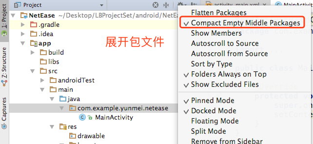
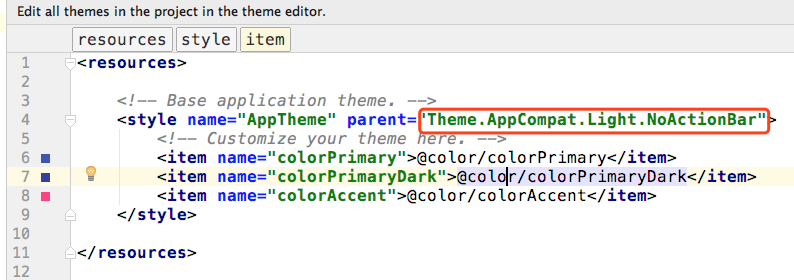
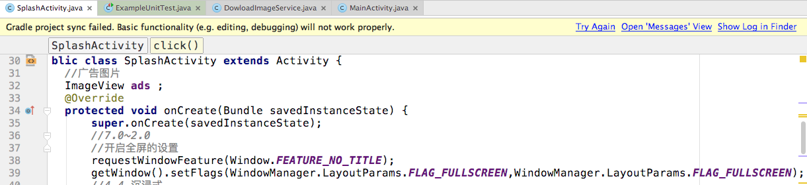

# 网易新闻
1.  连续的包名展开

2. 取消顶部的ActionBar

3. 设置全屏

4. 单例 工厂 代理 享元 光查找 创建者 责任链 观察者

5. 网络请求：volley（goole）
okhttp:不仅仅只是http请求，
okhttp-3.4.1.jar  绑定到library

6. 网络权限
   <uses-permission android:name="android.permission.INTERNET"/>

